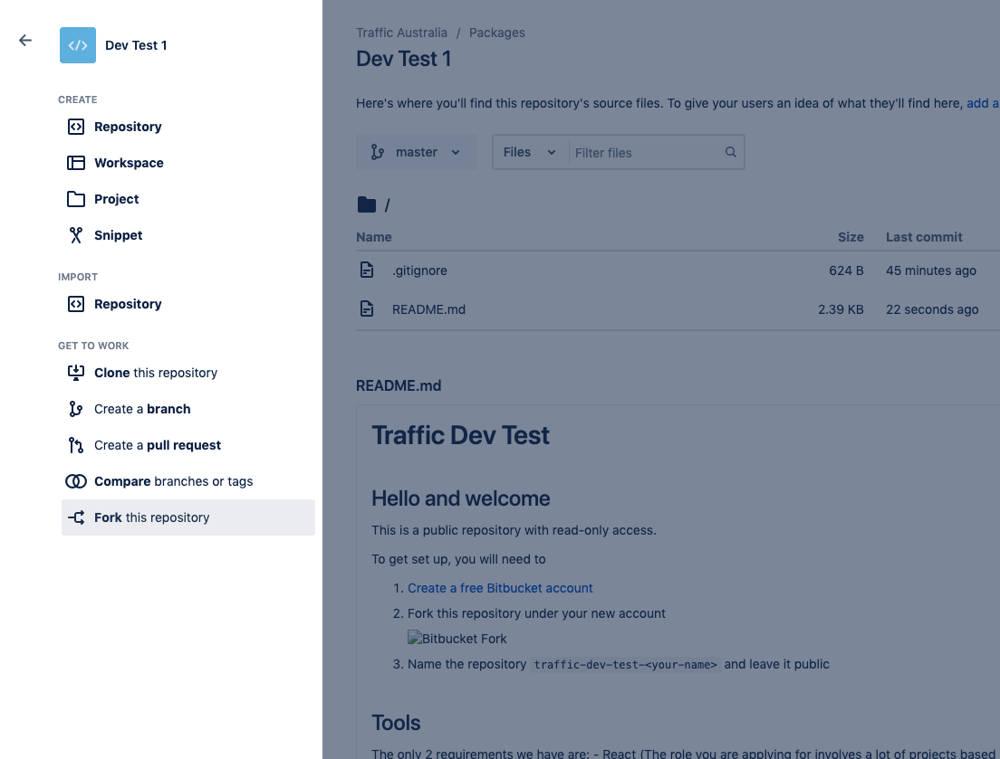

# Traffic Dev Test

## Hello and welcome

This is a public repository with read-only access.

To get set up, you will need to

1. [Create a free Bitbucket account](https://id.atlassian.com/signup)
2. Fork this repository under your new account

    

3. Name the repository `traffic-dev-test-<your-name>` and leave it public

## Tools

The only 2 requirements we have are:

- 	React (The role you are applying for involves a lot of projects based on React)
- 	No UI Library (Bootstrap, Tailwind CSS, etc. We are keen to see how you solve the styling part yourself)

The rest of the test is unopinionated in regards to the build tools, libraries and packages you wish to use.

## Your task

-   To complete the test you must implement a single web page based on the design at the following Figma link: [https://www.figma.com/file/R9K9hTVRy6XITEIfdG34ro](https://www.figma.com/file/R9K9hTVRy6XITEIfdG34ro). If you do not already have one, you will need to create a free Figma account, which you will be prompted to do when loading the link.
-   You must implement both breakpoints depicted in the designs in a responsive manner.
-	The slider must auto play, loop and have a fade effect
-	The form must submit/post to an API of your choice. (For example: formspree.io, mailthis.to, etc).
-   The design has an interactive form element, which can be built in any JavaScript library you feel comfortable with but must function in the following way:

    -   If 1 or less checkboxes are selected, the submit button is disabled and an error is shown asking users to select 2 or more services (not depicted in the designs, and up to you how this should look)
    -   If 2 or more checkboxes are selected, the submit button is enabled
    -   If 6 or more checkboxes are selected, the submit button is disabled and an error is shown asking users to select 5 or fewer services
    -   If the user refreshes the page, their selection should remain

## Notes

Browser Requirements

-   Chrome (Latest)
-   Firefox (Latest)
-   Edge (Latest)
-   Chrome Mobile (Latest)
-   Mobile Safari (Latest)

### Links

Any links can just point to #.

### Fonts

The fonts used in the design, are either a free Google Font or can be replaced by a similar free Google font of your choice.

### Submission

Email the link to your repository to [steven.mitchell@traffic.com.au](steven.mitchell@traffic.com.au), and include "Traffic Dev Test - your name" as the subject line.
